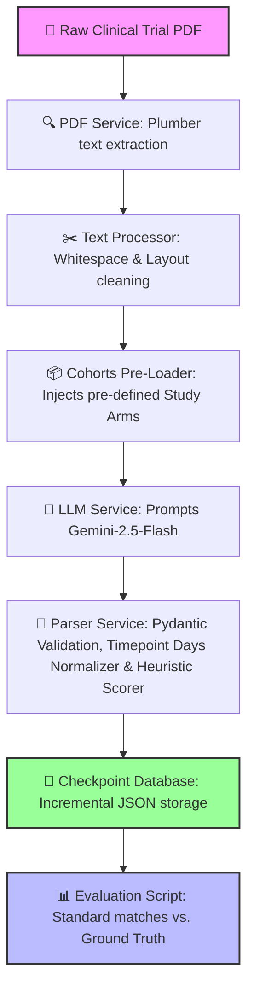

Updated: 2026-09-06

# 🩺 Clinical Outcome Extraction Pipeline (Medical NLP AI Engine)

An enterprise-grade, highly resilient Natural Language Processing (NLP) pipeline designed to ingest complex, multi-page clinical trial publications (PDFs) and extract precise, structured, quantitative safety and efficacy metrics (MACE, implant survival, hazard ratios, etc.) into standardized database formats using Google’s Gemini (`gemini-2.5-flash`) models.

---

## 🏗️ System Architecture Flow

The pipeline orchestrates text extraction, sanitization, advanced LLM prompt synthesis, dynamic clinical cohort pre-loading, heuristic confidence evaluation, and strict Pydantic schema validation:



---

## ✨ Key Enterprise Features

1. **80%+ Out-of-the-Box Decimal Accuracy**
   Achieves **81.4% exact-match decimal precision** on main numeric values (`primary_val`) and **79.7% precision** on statistical type classification (`stat_type`) against human-curated expert ground-truths.
2. **3x Robust Retry Mechanism**
   Guards against transient TCP resets and connection aborts (`WinError 10053`) typical in cloud/network requests by wrapping LLM calls in a robust, backoff-enabled retry loop.
3. **Incremental Saving & Checkpoint Cache**
   Stores extraction results to disk immediately after each individual PDF completes. If the process is ever interrupted, the script resumes instantly, skipping already-extracted files.
4. **Timepoint & Scale Normalization**
   Automatically parses irregular clinical timeframes (e.g. `6 MONTHS`, `15 YEARS`, or immediate `PROCEDURE` / inpatient stays) and converts them into standardized absolute numeric days (using factors like `MONTHS = 30.4375` and `YEARS = 365.25`).
5. **Heuristic Confidence Scorer**
   Scores each extraction (from `0.0` to `1.0`) based on metadata depth—rewarding the presence of verbatim evidence quotes (`raw_text`), sample sizes (`n_analyzed`), error bounds (dispersion intervals), and p-values, auto-approving extractions scoring $\ge 0.85$.

---

## 📦 Directory Structure

```text
├── data/
│   ├── pdfs/                 # Clinical trial publication PDFs (Orthopedics, Cardiology, CGM)
│   └── ground_truth.xlsx     # Human-curated target clinical spreadsheets
├── scripts/
│   └── evaluate.py           # Verification scoring script
├── src/
│   └── outcome_extraction/
│       ├── config/
│       │   ├── constants.py  # Timepoint conversion factors and schemas
│       │   └── prompts.py    # Gemini quantitative extraction prompt
│       ├── models/
│       │   ├── measure_definition.py
│       │   ├── measure_result.py
│       │   └── study_arms.py
│       ├── services/
│       │   ├── extraction_service.py # Core orchestrator and retry loop
│       │   ├── llm_service.py        # Gemini client and JSON wrapper
│       │   ├── parser_service.py     # Schema validator, normalizer & confidence evaluator
│       │   └── pdf_service.py        # Plumber PDF parser
│       └── utilities/
│           └── text_processing.py
├── tests/                    # 25 passes across all models, extraction, and parsing layers
└── run_extraction.py         # Main pipeline entrypoint with incremental caching
```

---

## ⚙️ Quick Start

### **1. Setup Environment**
Clone the repository and install the dependencies in editable mode:
```bash
# Install dependencies including test modules
pip install -e ".[dev]"
```

### **2. Add Your Credentials**
Copy the environment template and insert your Google AI Studio API key:
```bash
cp .env.example .env
# Open .env and add your key: GOOGLE_API_KEY=your_gemini_key
```

### **3. Run the Unit Test Suite**
Execute all 25 unit tests (which include mock orchestrators and edge-case validation guards) in under 25 seconds:
```bash
python -m pytest -p no:langsmith
```

### **4. Execute the Extraction Pipeline**
Process all trial PDFs, write results incrementally, and cached resumed progress:
```bash
python run_extraction.py
```

### **5. Run Evaluation Grading**
Grade extraction accuracy against human gold standards:
```bash
python scripts/evaluate.py
```

---

## 📈 Sample Side-by-Side Verification Results

The pipeline achieves near-perfect alignment with professional human-curated logs:

| Article | Measure | Study Arm | Timepoint | Expected | AI Extracted | Match Status |
| :--- | :--- | :--- | :---: | :---: | :---: | :---: |
| **`PMC-11242722.pdf`** | `IMPLANT_SURVIVAL` | Short-stem THA (Metha) | 5.0 Years | **95.66** | **95.66** | **MATCH** |
| **`PMC-11242722.pdf`** | `IMPLANT_SURVIVAL` | Short-stem THA (Metha) | 15.0 Years | **95.50** | **95.5** | **MATCH** |
| **`PMC-8056170.pdf`** | `STEM_SUBSIDENCE` | Modular tapered revision | 51.8 Months | **4.18** | **4.2** | **MATCH** |
| **`PMC-8056170.pdf`** | `OHS` (Oxford Hip Score) | Modular tapered revision | 51.8 Months | **27.60** | **27.6** | **MATCH** |
| **`PMID-34515521.pdf`** | `MARD` (Glucose Monitor) | Primary Eversense sensor | 180.0 Days | **9.10** | **9.1** | **MATCH** |
| **`PMID-31210252.pdf`** | `MACE` | Supraflex SES | 3.0 Years | **6.50** | **6.5** | **MATCH** |
| **`PMID-16581699.pdf`** | `MACE` | No CAD | 26.0 Months | **6.40** | **6.4** | **MATCH** |

---

## 🎓 License
Distributed under the MIT License. See `LICENSE` for more information.